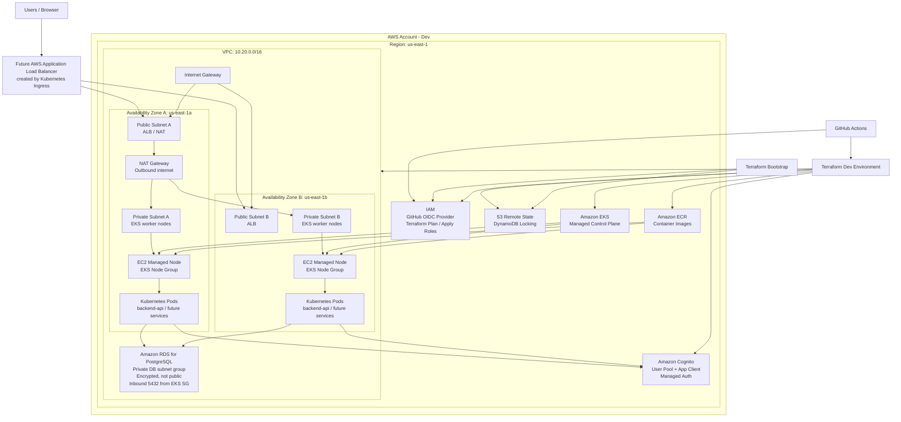
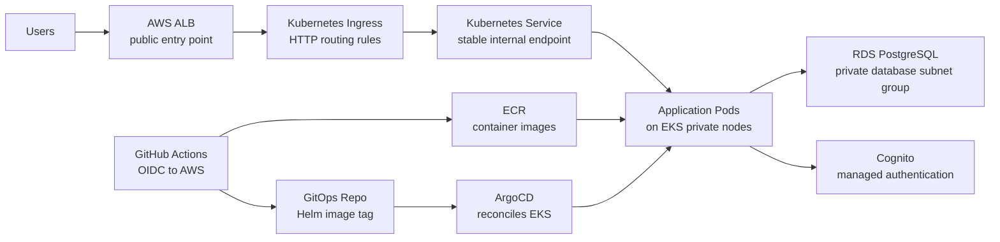
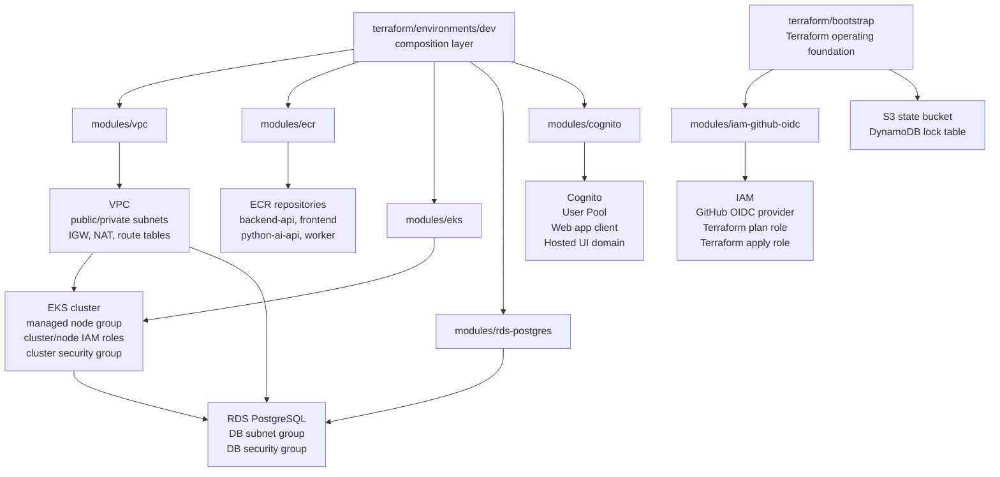

# Dev Environment Architecture

This diagram represents the current `dev` environment scaffold in this repo.

The current Terraform environment is:

```text
terraform/environments/dev
```

It composes these modules:

```text
terraform/modules/vpc
terraform/modules/ecr
terraform/modules/eks
terraform/modules/rds-postgres
terraform/modules/cognito
terraform/modules/iam-github-oidc
```

Bootstrap layer:

```text
terraform/bootstrap
```

Bootstrap owns:

```text
S3 remote state bucket
DynamoDB state lock table
GitHub Actions OIDC provider
Terraform plan/apply IAM roles
```

Optional EKS Blueprints Addons examples:

```text
terraform/environments/dev/eks-blueprints-addons.tf.example
terraform/environments/dev/eks-blueprints-providers.tf.example
```

## Standard AWS Dev Architecture



## Simplified Interview Diagram



## Terraform Module Relationship



## Interview Explanation

Use this version in interviews:

> In the current dev environment, Terraform composes separate VPC, ECR, EKS, PostgreSQL, Cognito, and IAM/OIDC modules. The VPC module creates public and private subnets, an internet gateway, NAT gateway, and route tables. EKS worker nodes and RDS PostgreSQL run in private subnets, which reduces direct internet exposure. PostgreSQL allows port 5432 only from the EKS cluster security group in this dev scaffold. ECR stores Docker images, Cognito provides managed user authentication, and GitHub Actions uses OIDC-backed IAM roles instead of long-lived AWS keys.

## EKS Blueprints Addons

We can use EKS Blueprints Addons after the base EKS cluster exists.

Role in this project:

```text
Terraform base modules
  -> VPC, EKS, ECR, RDS, Cognito, IAM
EKS Blueprints Addons
  -> AWS Load Balancer Controller
  -> EBS CSI driver
  -> metrics-server
  -> External Secrets
  -> optional ExternalDNS / cert-manager
GitOps repo
  -> application workloads through Helm + ArgoCD
```

Interview answer:

> I would use EKS Blueprints Addons for the EKS platform add-on layer, not to hide the whole infrastructure design. Our Terraform modules still own the base AWS foundation: VPC, EKS, ECR, RDS, Cognito, and IAM. Once the cluster exists, EKS Blueprints Addons can install standard operational add-ons like AWS Load Balancer Controller, EBS CSI, metrics-server, External Secrets, ExternalDNS, and cert-manager. That gives us AWS-recommended platform bootstrap patterns while keeping the core architecture explicit.

Implementation note:

> Apply base infrastructure first, then apply add-ons. Kubernetes and Helm providers need a reachable EKS cluster before they can install add-ons.

## Standard AWS Explanation

Use this when the interviewer asks about zones or production layout:

> The dev VPC is modeled across two Availability Zones. Each zone has a public subnet and a private subnet. Public subnets are used for internet-facing entry points like an Application Load Balancer and NAT. Private subnets run EKS worker nodes and application pods. RDS PostgreSQL is placed in a private database subnet group so it is not internet-facing. Cognito is not inside the VPC; it is a managed regional AWS identity service used by the frontend and backend for authentication. GitHub Actions authenticates to AWS through OIDC and assumes Terraform roles, avoiding static AWS access keys. This layout gives better availability, clearer network boundaries, and a standard AWS production pattern.

## Current Scope

Included now:

- Dev environment only.
- S3 remote state backend configured for dev.
- DynamoDB lock table configured for dev.
- VPC.
- Public subnets.
- Private subnets.
- Internet Gateway.
- NAT Gateway.
- Route tables.
- ECR repositories.
- EKS cluster.
- EKS managed node group.
- IAM roles for EKS and nodes.
- EKS OIDC provider for IRSA.
- GitHub Actions OIDC provider in bootstrap.
- Terraform plan/apply IAM roles in bootstrap.
- RDS PostgreSQL in private subnets.
- Cognito User Pool and app client.

Not included yet:

- `prod` environment.
- AWS Load Balancer Controller.
- ArgoCD installation.
- Kubernetes workloads deployed through Terraform.
- Redis, SQS, Bedrock, or monitoring resources.
